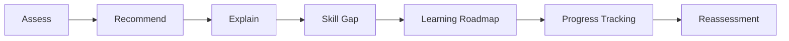

<div align="center">
  <h1>🎓 Campus Nova</h1>
  <p><strong>Student Career Guidance & Development Platform</strong></p>
  <p>
    
    
    
  </p>
</div>

<br />

## 📖 Project Overview

**Campus Nova** is a student-focused Career Guidance System designed to help students make better-informed career decisions. Through personalized assessment, career recommendations, skill-gap identification, learning roadmaps, and progress tracking, Campus Nova provides a structured approach to professional development.

It helps students seamlessly transition from asking *"Where am I now?"* to understanding *"What career fits me?"*, identifying *"What skills am I missing?"*, planning *"What should I learn next?"*, and ultimately measuring *"How am I progressing?"*.

---

## 🛑 The Problem

Students often face significant difficulty when navigating career choices due to:
- **Generic career advice** that lacks personalization.
- **Unclear skill requirements** for their desired industries.
- **Difficulty connecting education with employment** and understanding practical industry needs.
- **No structured way** to track career preparation over time.

## 💡 The Solution

Campus Nova addresses these issues by offering a structured, data-driven approach to career guidance. By replacing abstract advice with concrete milestones, skill-gap analysis, and progress tracking, the platform provides students with actionable steps toward their ideal careers.

---

## 🔄 Core Workflow



---

## ✨ Key Features

- **Authentication & Authorization**: Secure student and admin login system.
- **Student Profile**: Personalized profile tracking education level and basic details.
- **Career Assessment**: Interactive assessments to evaluate student aptitude and interests.
- **Career Recommendations**: Data-driven suggestions for suitable career paths based on assessment results.
- **Skill-Gap Analysis**: Clear breakdown of current skills vs. required skills for the target career.
- **Learning Roadmap**: Step-by-step milestones to help students bridge their skill gaps.
- **Progress Tracking**: Visual tracking of roadmap completion.
- **Dashboard**: Centralized hub for students to view their ongoing development.

---

## 👨‍💻 Student Experience

1. **Onboarding**: Students create an account and set up their profile.
2. **Assessment**: They complete a thorough assessment of their skills and interests.
3. **Discovery**: Based on the results, they receive personalized career recommendations.
4. **Planning**: Upon selecting a career, the platform highlights skill gaps and generates a custom learning roadmap.
5. **Execution**: Students follow the roadmap, ticking off milestones and tracking their progress through their dashboard.

---

## 🏗️ Technical Architecture

Campus Nova is built on a solid traditional web architecture:

- **Frontend**: HTML5, CSS3, JavaScript, and Bootstrap 5 for a responsive, accessible user interface.
- **Backend**: PHP handles business logic, routing, and session management.
- **Database**: MySQL for robust relational data storage.

*For a detailed architectural view, see the [Architecture Diagram](docs/architecture.md).*

---

## 🗄️ Database Design

The database is structured to securely store user data, link assessments to profiles, and track roadmap progress. 

*For the complete entity-relationship structure, see the [Database Diagram](docs/database.md).*

---

## 📁 Project Structure

```text
Campus Nova/
├── admin/               # Admin dashboard and management tools
├── api/                 # Backend API endpoints
├── assets/              # CSS, JS, and image resources
├── auth/                # Authentication logic (login/register)
├── config/              # Configuration files (DB connection)
├── database/            # Database schema and initial seed data
├── docs/                # Architecture and Database documentation
├── student/             # Student dashboard and features
├── teacher/             # Teacher/Mentor features
├── index.php            # Application entry point
└── schema_dump.sql      # Database schema export
```

---

## 🚀 Installation & Setup

### Prerequisites
- PHP >= 7.4
- MySQL >= 5.7
- Web Server (Apache/Nginx or built-in PHP server for dev)

### Local Setup

1. **Clone the repository**
   ```bash
   git clone https://github.com/Grish2219/Campus-Nova.git
   cd Campus-Nova
   ```

2. **Database Setup**
   - Create a new MySQL database named `campus_nova` (or your preferred name).
   - Import the provided schema:
     ```bash
     mysql -u root -p campus_nova < schema_dump.sql
     ```

3. **Environment Configuration**
   - Navigate to the `config/` directory.
   - Update the database credentials (host, username, password, dbname) to match your local setup.

4. **Run the Application**
   - Using PHP's built-in server:
     ```bash
     php -S localhost:8000
     ```
   - Visit `http://localhost:8000` in your browser.

---

## 🔒 Security Measures

- **Authentication**: Secure session-based authentication.
- **Password Hashing**: User passwords are encrypted before storage.
- **Role-based Access**: strict separation between Student, Teacher, and Admin routes.
- **Input Validation**: Sanitization of user inputs to prevent SQL injection and XSS.

---

## 🗺️ Future Roadmap

- [ ] Implementation of AI-assisted personalized career paths.
- [ ] Integration with real-time job market APIs.
- [ ] Advanced analytics for admins to track student success rates.
- [ ] Email notifications for roadmap milestones.

---

## 👤 Author

**Grish**
- GitHub: [@Grish2219](https://github.com/Grish2219)

---

<p align="center">Built for students. Engineered for the future.</p>
